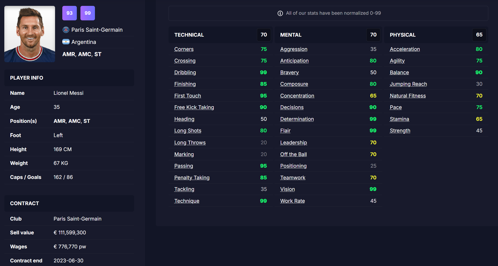

# STATS 418 Final Project - Football Manager 2023 Player Pricer & Recommender
 
### Roy Zhang

### [Link to app here.](https://zhonghengzhang-stats-418-final-project.streamlit.app/)

## Background

This app runs the 

## Data Collection and Exploratory Data Analysis

The data was obtained from [FMInside](https://fminside.net/) with BeautifulSoup using an existing list of player UID. All information in the image below are collected.

## Methodology

### Pricer 
The model of choice for the pricer in this project is [histogram-based gradient boosting decision tree](https://scikit-learn.org/stable/auto_examples/ensemble/plot_hgbt_regression.html) (random forest, mentioned the final presentation, was dropped last-minute due to model size) for its balance between performance, compiling speed, and model size.

### Recommender

For the recommender, the app collects the filter selected by the users and runs query command to find the list of players that meet the given criteria. If no such player exists or all players meet the criteria are not for sale, the app will ask the user to adjust the filter to find suitable players. If there is at least one player found, the app will return the single best fit for the following 3 categories using the given sorting rules:

- Best player: highest CA, cheapest, youngest, lowest salary.
- Cheapest player: cheapest, highest CA, youngest, lowest salary.
- Youngest player: youngest, cheapest, highest CA, lowest salary.

## Results

The 

