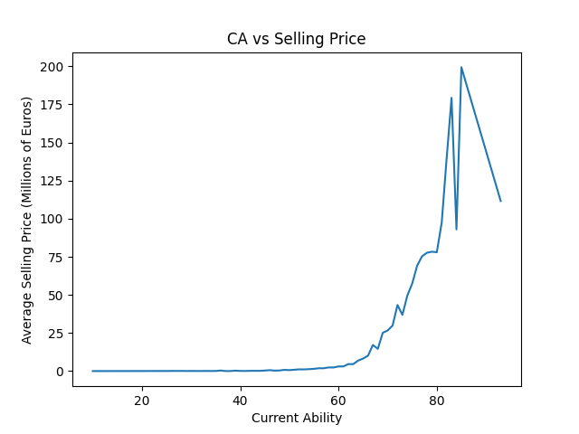

# STATS 418 Final Project - Football Manager 2023 Player Pricer & Recommender
 
### Roy Zhang

### [Link to app here.](https://zhonghengzhang-stats-418-final-project.streamlit.app/)

## Data Collection and Exploratory Data Analysis

The data was obtained from [FMInside](https://fminside.net/) with BeautifulSoup using an existing list of player UID. All information in the image below are collected.

In the player profile above, there are 3 major sections: the player's basic information (top left), contract information (bottom left), and attributes (right). Since FMInside rescaled the attributes from 1-20 to 5-99, it will be rescaled back.

Above is the histogram of the players' sell values. Since the football hierarchy is a pyramid structure, there are significant more player with low selling price than those with high selling price.

Above is the plot of the player's CA (current ability) plotted against the selling price of the player. CA is not an in-game attribute, but rather a summarisation of the attributes. The formula for CA calculation is unknown, but all attributes listed in the FMInside player profile are positively correlated to them. The plot shows that the sell value increases exponentially as CA increases, but fluctuates violently at very high CA level. This is because there are very few players with very high CA, and some of them have low sell value due to their age.

Above is a scatter plot of age plotted against the selling price. Players aged 20-30 have larger spread in sell value compared to the rest. This is because many players aged 19 or below have just started their professional career and those aged 31 or above have past their prime and are starting to decline. This suggests a linear regression for the model is unlikely to give an accurate prediction of the sell value

## Methodology

### Pricer 
The model of choice for the pricer in this project is [histogram-based gradient boosting decision tree](https://scikit-learn.org/stable/auto_examples/ensemble/plot_hgbt_regression.html) (random forest, mentioned the final presentation, was dropped due to compiling speed) for its balance between performance, compiling speed, and model size.

Some players are labelled **Not for sale**, which means their club will supposedly reject any bid (unless the player submits an antronomically high bid). There are also **free agent** players, who starts off without a club. These players are removed from the dataset when training the pricer model.

The predictor used are all attributes, age, and a `Contract Expiring` boolean variable, defined by whether the player's contract will expire before 1 July, 2023.

### Recommender

For the recommender, the app collects the filter selected by the users and runs query command to find the list of players that meet the given criteria. If no such player exists or all players meet the criteria are not for sale, the app will ask the user to adjust the filter to find suitable players. If there is at least one player found, the app will return the single best fit for the following 3 categories using the given sorting rules:

- Best player: highest CA, cheapest, youngest, lowest salary.
- Cheapest player: cheapest, highest CA, youngest, lowest salary.
- Youngest player: youngest, cheapest, highest CA, lowest salary.

## Results

The app allows you to add filters based on age, contract status, and in-game attributes. To add filter on age, you will first check the `Age` checkbox, and then the slider for age will appear. The `Contract Expiring` checkbox represents the boolean variable in the pricer. The `Position` selectbox is purely for recommender and does not affect the pricer. The `Attribute` multiselect box allows the player to select all attributes present. Once the user selects an attribute, a slider will appear below the multiselect. Unselecting the attribute will remove the slider.

Once the player performs a filter action, the app will recalculate the sell value and the recommended players.

